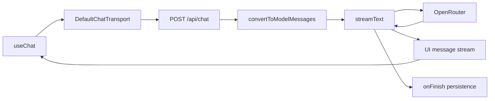

# AI integration

## Provider architecture

Neuron uses AI SDK v6 as the provider-neutral streaming layer and `@openrouter/ai-sdk-provider` as the concrete provider. The API key never needs to enter the browser.

## Model discovery and selection

`useAIModels` queries `/api/ai/get-models`. The server filters models with zero prompt and completion prices, while the selector exposes description, context window, modalities, tokenizer, moderation, and pricing metadata.

Why server-side discovery: it hides the OpenRouter key and centralizes provider filtering. Tradeoff: every uncached client query depends on OpenRouter availability. Add server caching and a validated fallback catalog for resilience.

## Streaming lifecycle

1. `useChat` maintains UI messages and statuses (`submitted`, `streaming`, etc.).
2. The transport posts history and custom body fields.
3. `convertToModelMessages` translates rich UI parts to provider messages.
4. `streamText` applies `CHAT_SYSTEM_PROMPT` and selected model.
5. `toUIMessageStreamResponse` emits text and reasoning parts.
6. `consumeStream()` ensures server consumption continues.
7. `onFinish` serializes and stores completed messages.

Reasoning is requested with `sendReasoning: true`; provider/model support varies, so the UI must tolerate absent reasoning.

## System prompt

The prompt is a static server module defining identity, tone, safety, coding behavior, and conversation rules. Keeping it server-side avoids accidental client exposure as configuration and guarantees a shared baseline. It is not a substitute for moderation or authorization.

## Message IDs

AI responses use `createIdGenerator({ prefix: "msg", size: 16 })`. Stable client/server IDs allow `skipDuplicates` to make finalization more tolerant of retries.

## Reliability and cost controls to add

- Authenticate and authorize every chat request.
- Validate model IDs against an allowlist returned by trusted discovery.
- Apply per-user/IP rate limits, concurrency limits, and quotas.
- Cap message count, prompt bytes, and provider timeout.
- Budget context tokens and summarize old turns.
- Handle provider errors with typed UI parts and retry policy.
- Record latency, model, token usage, finish reason, and cost.
- Decide whether provider reasoning should be stored or shown; it may contain sensitive intermediate content.
- Add moderation appropriate to the deployment’s audience and policy.

