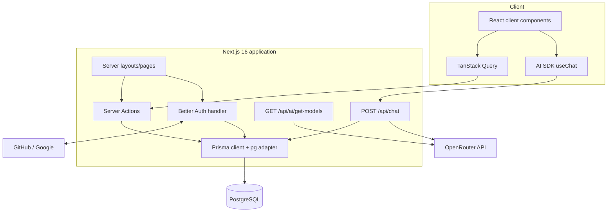
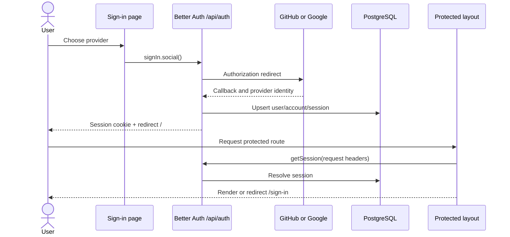
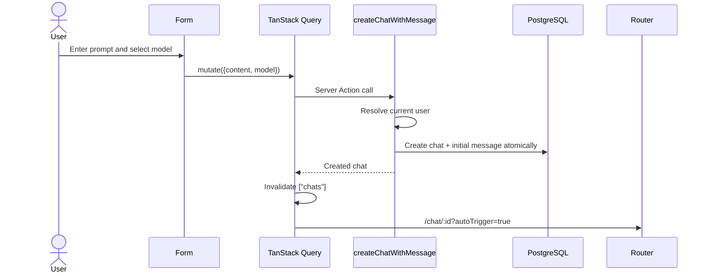
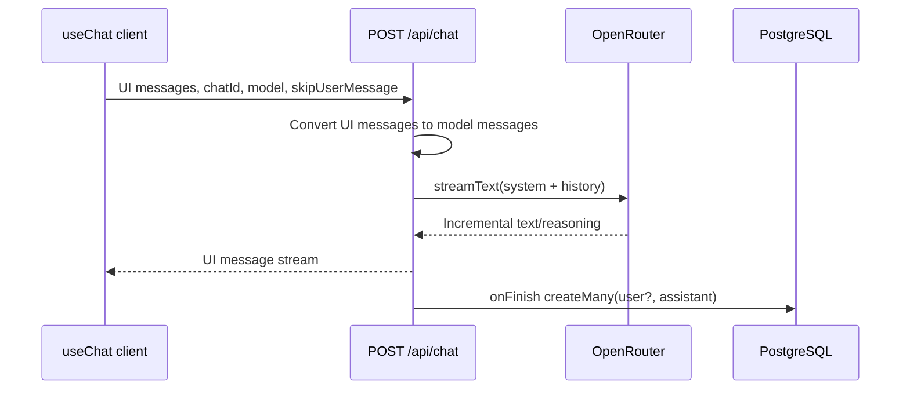

# Architecture

## Goals and boundaries

Neuron is a modular monolith: UI, backend-for-frontend endpoints, authentication, and data access ship as one Next.js application, while PostgreSQL and OpenRouter remain external services. This keeps deployment and type sharing simple at the project’s current scale. Feature modules prevent the monolith from becoming a flat collection of route-specific code.

## System architecture

## Request flow

1. The root layout installs query, theme, tooltip, and toast providers.
2. Route-group layouts run on the server. `(root)` calls `requireAuth`; `(auth)` calls `requireUnAuth`.
3. Interactive feature components hydrate on the client.
4. Chat CRUD invokes authenticated Server Actions. AI operations use Route Handlers because streaming requires an HTTP response body.
5. Prisma executes parameterized queries through `PrismaPg` and a `pg` pool.

This split avoids calling internal HTTP endpoints from Server Components while retaining a real transport boundary for streaming.

## Authentication flow

Authorization is repeated inside chat Server Actions because layout checks are navigation guards, not a security boundary.

## Chat creation flow

The nested Prisma create makes the chat and first message one database operation. The query flag lets the conversation page generate the first assistant response without duplicating the already-persisted user message.

## AI response flow

Persistence occurs after stream completion so partial assistant output is not treated as complete history. The tradeoff is that a disconnected or failed stream may leave no assistant record.

## Database interactions

All current application data access runs through the singleton Prisma client. Authentication tables are managed by Better Auth through Prisma; chat actions use ownership predicates (`userId`) for reads and deletes. Cascading foreign keys remove sessions/accounts/chats with a user and messages with a chat.

## Frontend architecture

- **Server Components:** route layouts and pages; session lookup and redirects stay server-side.
- **Client Components:** forms, model selector, sidebar, Query hooks, `useChat`, theme controls.
- **Primitives:** `components/ui` contains shadcn-generated building blocks.
- **AI Elements:** `components/ai-elements` renders streamed message parts.
- **Features:** `modules/*` colocates actions, components, hooks, constants, and types.

## Server Actions and API routes

| Mechanism | Used for | Why |
| --- | --- | --- |
| Server Actions | Chat create/read/delete; session helpers | Typed, same-application mutations without hand-written HTTP contracts |
| Route Handlers | Better Auth, model catalog, AI stream | Third-party callbacks and streaming require HTTP semantics |

## Query and local state

TanStack Query owns remote state (`chats`, `chat by id`, model catalog). React state owns ephemeral UI state such as selected model, prompt text, modal visibility, search, and active suggestion tab. AI SDK’s `useChat` owns the live conversation stream.

## Error handling

Current layers return structured action failures, HTTP 500 JSON, inline chat errors, and toast notifications. Stream-persistence errors are logged but do not invalidate a response already delivered to the user. There are no route `error.tsx`, `not-found.tsx`, observability integration, or typed error taxonomy yet; production work should add them.

## Key tradeoffs

| Decision | Benefit | Cost |
| --- | --- | --- |
| Modular monolith | Simple deployment and shared types | App and AI traffic scale together |
| Client Query over Server Actions | Fast cache invalidation and transitions | Extra client JavaScript and action serialization |
| Full history per AI request | Provider receives conversation context | Token use grows with conversation length |
| JSON message parts in `Text` | Preserves AI SDK part shape flexibly | Database cannot query part fields efficiently |
| Provider catalog at request time | Current model availability | External dependency, latency, no cache policy |

