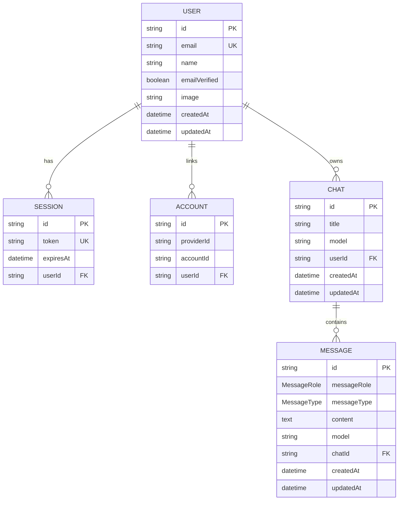

# Database

## Overview

Neuron uses PostgreSQL through Prisma 7. The datasource URL is supplied in `prisma.config.ts`; runtime queries use `PrismaClient` with `PrismaPg` and a `pg.Pool`. Development reuses one client through `globalThis` to avoid hot-reload connection proliferation.

## Entity relationship diagram



`Verification` and legacy `Test` are standalone models and therefore omitted from relationship lines.

## Models

| Model | Purpose | Constraints/indexes |
| --- | --- | --- |
| `Test` | Initial scaffold artifact; not used at runtime | `id` primary key |
| `User` | Better Auth identity and chat owner | PK `id`; unique email |
| `Session` | Better Auth login session | Unique token; index `userId`; cascade on user delete |
| `Account` | OAuth/provider credentials | Index `userId`; cascade on user delete |
| `Verification` | Expiring verification challenges | Index `identifier` |
| `chat` | User conversation and default model | Index `(userId, updatedAt)`; cascade on user delete |
| `Message` | Persisted user/assistant UI-message parts | Text content; index `(chatId, createdAt)`; cascade on chat delete |

## Enums

- `MessageRole`: `USER`, `ASSISTANT`
- `MessageType`: `NORMAL`, `ERROR`, `TOOL_CALL`

Only `NORMAL` is currently written. The broader enum anticipates error/tool records, but readers must not assume those flows are implemented.

## Message representation

New AI route records serialize `UIMessage.parts` into the `content` text column. Older initial messages are stored as plain text; the transcript parser supports both formats. This is migration-tolerant but weakly typed at rest. A future schema could use PostgreSQL `Json` plus a version column.

## Query behavior

- Chat creation uses nested `messages.create`, making the initial chat/message atomic.
- Chat reads include messages but do not explicitly order them. Add `orderBy: { createdAt: "asc" }` for deterministic transcripts.
- The sidebar query includes every message for every chat to support browser-side search. This is simple but will become expensive; move search into PostgreSQL and paginate.
- AI completion persistence uses `createMany(..., skipDuplicates: true)` to tolerate repeated stream-finalization IDs.

## Migration strategy

Development:

```bash
npx prisma migrate dev --name descriptive_change
npx prisma generate
```

Production:

```bash
npx prisma migrate deploy
npx prisma generate
```

Commit both schema and generated migration SQL, but not `lib/generated/prisma`. Never use `db push` as the production release mechanism. Back up production data before destructive changes and use expand/migrate/contract phases for zero-downtime changes.

## Current migration history

1. `20260603173530_db_initialization`: creates legacy `Test`.
2. `20260604145822`: creates Better Auth tables and indexes.
3. `20260613094230_chat`: creates chat/message enums, tables, indexes, and foreign keys.

## Operational guidance

Size the pool for the deployment model; many serverless instances can otherwise exhaust PostgreSQL connections. Use a managed pooler where appropriate. Monitor connection count, slow queries, migration duration, and table/index growth.

