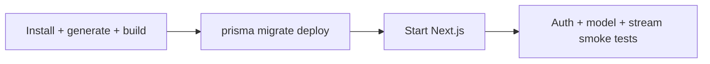

# Deployment

## Runtime requirements

- Node.js 22 recommended to match GitHub/GitLab CI
- PostgreSQL reachable over TLS in production
- Persistent environment secrets
- Outbound HTTPS access to OAuth providers and OpenRouter
- A platform capable of streaming responses without buffering

## Local development

```bash
npm ci
docker compose up -d postgres
npx prisma migrate dev
npx prisma generate
npm run dev
```

The Compose service exposes PostgreSQL 17 on `localhost:5432` with database `t3chat`. It does not package the Next.js application.

## Production release sequence



Use a single migration job per release, not one migration runner per autoscaled application instance. Back up before destructive migrations.

## Vercel

1. Import the repository.
2. Provision managed PostgreSQL and set `DATABASE_URL`.
3. Add OAuth, OpenRouter, and Better Auth secrets to each environment.
4. Configure provider callback URLs for production and previews.
5. Ensure Prisma generation occurs during install/build (add a `postinstall` script if the platform does not run it).
6. Run `npx prisma migrate deploy` in a controlled release job.
7. Verify the platform/provider streaming duration and function limits.

The hard-coded auth client base URL must be removed before a Vercel deployment can authenticate reliably.

## Docker/self-hosting

The repository needs an application `Dockerfile` before full container deployment. A production image should use multi-stage installation/build, run as a non-root user, expose port 3000, and start `next start` (or Next.js standalone output if configured). Put it behind a TLS reverse proxy and disable response buffering for `/api/chat`.

Do not bake `.env` files into images. Inject secrets at runtime.

## Health and observability

Add separate liveness and readiness endpoints. Readiness should verify configuration and optionally a lightweight database query without calling OpenRouter. Capture structured logs, request IDs, auth failures, provider latency/errors, stream completion, database pool metrics, and migration status.

## Rollback

Application rollbacks must remain compatible with the deployed schema. Prefer backward-compatible migrations. Rolling back migration SQL is not automatically safe; restore from backup or apply an explicit forward fix.

