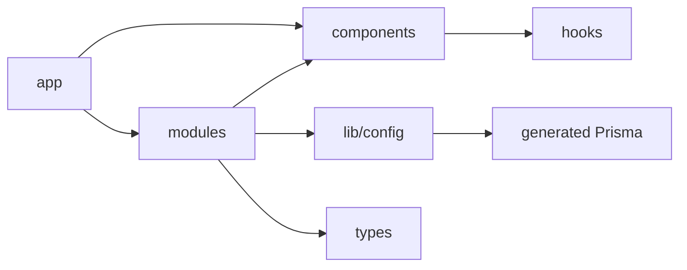

# Project structure

Neuron uses route-oriented files in `app/`, reusable infrastructure in `components/` and `lib/`, and domain-oriented code in `modules/`.

| Path | Purpose | Responsibilities and examples | Best practices |
| --- | --- | --- | --- |
| `app/` | Next.js App Router | Route groups, pages, layouts, global CSS, Route Handlers | Keep pages thin; await Next.js 16 `params`; use handlers only for HTTP boundaries |
| `app/(auth)/` | Public-only auth experience | `/sign-in`; redirect authenticated users | Do not put authorization solely in this layout |
| `app/(root)/` | Authenticated application shell | Sidebar/header and `/chat/[chatId]` | Keep session checks server-side; add route loading/error UI |
| `app/api/` | HTTP endpoints | Better Auth, model catalog, chat stream | Validate body/query data and authenticate each sensitive handler |
| `components/` | Cross-feature UI | Header, providers, delete modal | Avoid domain data access in generic components |
| `components/ui/` | shadcn primitives | Buttons, dialogs, inputs, sidebar | Treat as locally owned generated code; compose rather than fork unnecessarily |
| `components/ai-elements/` | AI-specific presentation primitives | Messages, reasoning, prompt input, artifacts | Render supported `UIMessage` parts explicitly and safely |
| `modules/` | Feature modules | `auth`, `chat`, `messages` | Colocate actions/hooks/components; expose narrow feature APIs |
| `modules/auth/` | Identity feature | Session helpers, user menu, auth types | Recheck auth at every server mutation |
| `modules/chat/` | Conversation domain | CRUD actions, sidebar, model hooks, welcome view | Scope all database operations to the current user |
| `modules/messages/` | Active transcript UI | AI SDK transport, stream rendering, persistence trigger | Keep transport state separate from Query cache |
| `hooks/` | Shared browser hooks | Mobile breakpoint detection | Feature-specific hooks belong under their module |
| `lib/` | Server/shared infrastructure | Better Auth, Prisma, system prompt, utilities | Keep secrets server-only; add `server-only` guards to server modules |
| `lib/generated/prisma/` | Generated Prisma client | Client, enums, models | Never hand-edit or commit; regenerate after schema changes |
| `prisma/` | Data contract and migrations | Schema and chronological SQL migrations | Commit migrations; use `migrate deploy` in production |
| `types/` | Cross-feature contracts | OpenRouter model response shape | Prefer source-derived types where possible; validate external data |
| `config/` | Configuration boundary | Zod environment parsing | Fail fast with actionable errors; document every variable |
| `public/` | Static browser assets | Logo and provider icons | Use root-relative URLs and optimized `next/image` where appropriate |

## Dependency direction

Lower-level UI and utility modules should not import route files. `lib/auth.ts` and `lib/db.ts` are server infrastructure and should not enter client bundles.

## Naming notes

The Prisma model `chat` is lowercase while TypeScript domain types use `Chat`; preserve generated API names until a deliberate migration renames the model. `modules/messages/messsage-view-form.tsx` contains a spelling error in its filename; update imports atomically if it is renamed.

## Adding a feature

1. Add a folder under `modules/<feature>`.
2. Keep route files as composition points.
3. Put authenticated mutations in server-only actions or Route Handlers.
4. Add Zod schemas at untrusted boundaries.
5. Place generic visual primitives in `components/ui`, feature UI in the module.
6. Document environment, database, and operational changes in the same pull request.

